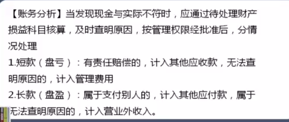

- [一知半解](#一知半解)
- [初学乍练](#初学乍练)
- [略有小成](#略有小成)
- [库存现金](#库存现金)
- [银行存款](#银行存款)

# 一知半解

### 什么是会计

将生产活动中发生的经济业务用数字的形式表现出来，管理者或经营者
通过他可以了解是赚还是亏，了解企业以前的业绩，发现存在的问题，预测未来发展的一个信息系统。

会计是以货币为主要计量单位，运用专门的方法，核算与监督一个单位的经济活动的一种经济管理工作。

### 会计基础

#### 小案例

老板记的账

| 项目           | 金额熵（元）   |
| -------------- | -------- |
| 销售收入       | +62000 |
| 采购商品       | -31000 |
| 吃饭           | -1000  |
| 支付投标保证金 | -3000  |
| 交第二季度房租 | -12000 |
| 交电话费       | -500   |
| 先别人借款     | +5000   |
| 结算           | +19500 |

会计部记账

项目|金额（元）
--|--|
借：库存现金|62000
-- 贷: 主营业务收入|62000
借：库存商品|31000
-- 贷：银行存款|31000
借：管理费用--业务招待|1000
-- 贷：库存现金|1000
借：其他应收款--保证金|3000
-- 贷：库存现金|3000
借：管理费用--房租|12000
-- 贷：库存现金|12000
借：管理费用--通讯费|500
-- 贷：银行存款|500
借：库存现金|5000
-- 贷：其他应付款|5000
利润|48500

两种记账都是对的，第一种是流水账，记录钱的流出和流入，第二种就是会计的复试借贷法

会计基础：

1. 会计主体
2. 会计分期
3. 持续经营
4. 货币计量
5. 会计科目
6. 账户
7. 借贷记账法
8. 权责发生制

老板采用的是权责发生制相对应的`收付实现制`

 
#### 什么是权责发生制

> 美人鱼公司2月销售了一批罐头价值10万元，3月收到货款

那么10万元确认为2月份收入还是3月份收入？

对于`权责发生制`，应该2月份确定收入，因为不管钱是否到账，合同签订了就应任务当月收入

对于`收付实现制`，应该3月份确定收入，因为钱是三月份到账。

对于我国会计均统一使用`权责发生制`

> 1月份支付了两年的房租10万元

根据`权责发生制`，我们应该在1月份确定的支出为当月的房租，而不能全部10万元当作当月支出计入。剩下的分两年依次计入。

- 练习题

### 会计基本假设

1. 会计主体
2. 持续经营
3. 会计分期
4. 货币计量

会计主体：

- 购货单位
- 销货单位

确定自己的角度，了解发票是买还是卖

持续经营：

会计核算企业看做是持续经营的主体，以持续，正常生产经营活动为前提。不考虑破产等情况。

会计分期

会计准则规定，企业应当划分会计期间，分期结算账目，编制财务报告

如年度，半年，季度，月度

货币计量

假定一切经济业务都可以用货币计量。

如其他企业赠送一些设备到我方公司，需要估量设备的价值，作为企业的一部分财产记账

# 初学乍练

### 复式记账法

对每一笔经济业务，都必须用相等的金额在两个或者两个以上的账户中进行登记，全面系统的反应会计要素的增减变化的一种记账方法

一般账户会分为借方和贷方

### 会计科目

账户有时候可以等价于科目，账户具有一定的格式结构，用于分类反映会计的变动情况及其结果的载体

会计科目反映经济内容，所提供信息的详细程度及其统奴关系分类

按经济内容划分:

1. 资产类
2. 负债类
3. 所有者权益类
4. 成本类
5. 损益科目类

按详细程度划分：

1. 总分类科目
2. 明细分类科目

### 会计账户 (Accounting subjects)

- 资产类

账户的功能在于连续、系统、完整地记载会计科目的增减变动及其结果的具体信息

会计科目在特定的会计期间增加和减少的金额，分别称为账户的“本期增加发生额和“本期减少发生额”
增减变化的结果，称为账户的余额，具体表现为`期初余额`和`期末余额`，账户上期的期末余额转入本期，即是本期的期初余额:账户本期的期末余额转入下期，即为下期的期初余额。

- 账户丁字帐结构

### 借贷记账法

- 有借必有贷，借贷必相等

借贷记账法是以“借“命作为记账符号的一种复式记账方法，即发生的经济交易与事项所引起会计要素的增减变动以相等的金额，同时在两个或两个以上的账户中进行记录。

- 会计分录

会计分录简称分录,是对每项经济业务列示出应借、应贷的账户名称及其金额的一种记录。
分录由借贷方向、会计科目、金额三个要素构成

- 常见错误

1. 分不清主体
2. 拿不准科目
3. 借贷方向搞错

# 略有小成

资产 = 负债 + 所有者权益

利润 = 收入 - 费用

### 资产类科目

资产是指企业过去的交易或事项形成

由企业拥有或者控制的

预期会给企业带来经济利益的资源

资产科目

# 库存现金

现金管理办法;只有在规定范围内可以采用现金结算其余都必须通过
银行办理转账结算。
库存现金限额般为3-5天的日常零星开支
日常零星开支=前一个月的平均每天支付的数额(不合工资)x限定天数

- 练习题

- 常见错账调整

- 盘点

- 调账

- 查账

查账步骤

- 查账前准备

1. 明确查账对象，查找目的和查账要求
2. 配备查账人员
3. 拟定查账方案

- 查账实施

步入现场进行实地观察，集体审阅会计资料和其他备查资料，进行对比分析，形成查账工作底稿

- 查账总结

查账人员集体汇审，形成查账结果报告

- 查账方法

顺查法
逆差法
详查
抽查

# 银行存款

- 科目方向

- 账务处理

与银行对账不一致

- 银行对账公式

- 资产负债表1

