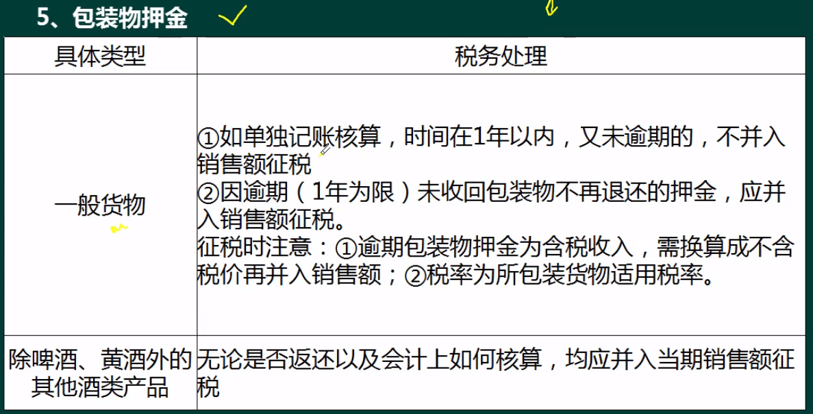

# 增值税 (VAT value added tax)


- 常见税种
  
1. 增值税
2. 附加税：城市建设，教育税
3. 企业所得税
4. 个人所得税
5. 印花税
6. 房产税
7. 契税


- 概念

增值税，以商品（含应税劳务，销售服务，无形资产或不动产）流转过程中产生的增值额为计税依据而征收的一种`流转税`

增值税在商品的生产和销售过程中的各个环节`分段征收`
最终实现对`消费环节全额征收`，可避免重复征税问题

- 计算示例

购进材料 - 10w
销售产品 - 50w

增值额 = 销售产品 - 购进材料 = 40w
税额 = 40w x 17% = 6.8w

- 示例

如下，商品的价值在不同角色流转增值过程:

> 厂家(10) -> 批发商(100) -> 零售(120) -> 消费者(200)

假设增值税率按0.17算，以下是各个角色需要缴纳的税款计算

厂家角度:
```
成本: 10
售价: 100

增值额 = 100 -10 = 90
增值税率 = 17%
应缴纳税款 = 90 x 17% = 16.3
```

批发商角度:
```
成本: 100
售价: 120

增值额 = 120 - 100 = 20
缴纳额 = 20 x 17%
```

剩下的以此类推

> 应纳税额 = 销项税额 - 进项税额   
> 如厂家： (100x17%) - (10x17%)

进项税额需要发票作为凭证，即发票可以抵消税额


### 适用范围

#### 使用范围:  

- 销售货物
  - 生产销售
  - 批发销售
  - 零售销售
- 进口货物
- 提供应税劳务
  - 修理修配劳务

> 营改增： 营业税改增值税

- 应税服务
  - 交通运输
    - 陆运
    - 水运
    - 航空
    - 铁路
    - 管道
  - 现代服务
    - 研发技术
    - 信息技术
    - 文化创意
    - 物流辅助
    - 有形动产租凭
    - 鉴证咨询服务
  - 邮政业
  - 电信业

#### 适用税率:

营改增取消13%税率，4档减档

- 17%
- 11%
- 6%
- 0%
- 

范围


征收率：

小规模纳税人只能采用简易计税法 = 3%
一般纳税人可采用一般计税方法和简易计税


1. 小规模纳税人增值税征收率为 3%，征收率的调整由国务院决定
2. 小规模纳税人（除其他个人外）销售自己使用过的固定资产，减按2%征收率征收增值税，且只能开普通发票，不能由税务机关代开增值专用发票

小规模：
税额 = 征收率 x 销售额

增值税分为`普通发票`和`专用发票`


增值税税负：
实际缴纳的增税占销售货物提供税劳务或服务取得的全部价款和价外费用比

- 小例子

含税金额 100   
税率 3%   
不含税金额 = 100/(1+0.03) = 5.66


小规模价格 <= 86.55%（一般纳税人价格）可选小


应纳税额


- 价外费





